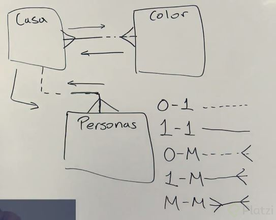
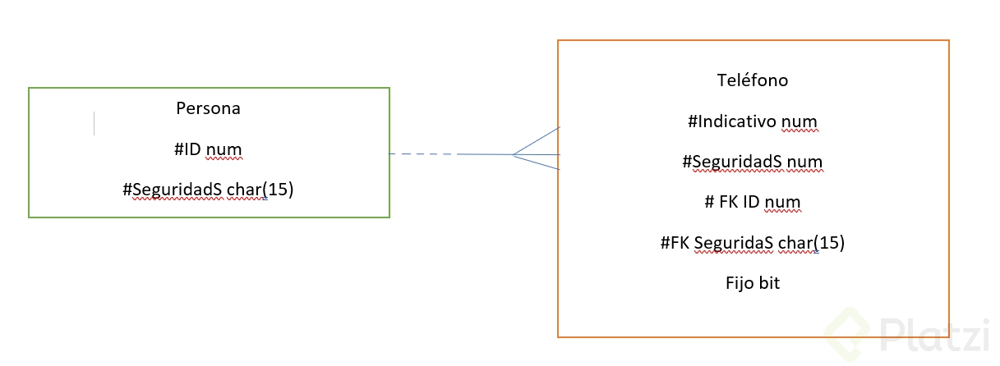

# GUIA DE FUNDAMENTOS DE BASES DE DATOS EN PLATZI
**Una guía sobre el curso de  "Fundamentos de bases de datos" en Platzi.**

# 2. TEORÍA GENERAL DE BASES DE DATOS

**# Propósito general de las Bases de Datos** 
Las Bases de Datos nacieron con el propósito de almacenar información importante. Comenzaron (obviamente) en papel.
Podríamos imaginar una Base de Datos clásica con el clásico formato de carpetas organizadas con rótulos en estantes.
La forma de Bases de Datos tradicional sirven para almacenar en el tiempo. Pero son ineficientes a la hora de dar con la información.

Dadas las imperfecciones humanas y el avance de la tecnología. Las Bases de Datos empezaron a ser parte de los computadores.

Los datos por sí solos no representan nada. Es al momento de crear el reporte en el que los datos pueden convertirse en información importante.

¿Cómo han evolucionado las Bases de Datos?

### Historia de las Bases de Datos.

1950-1960: Maquinas tabuladoras, tarjetas perforadas y cintas magnéticas.

1960-1979: Modelos jerárquicos, discos duros, modelo de data relacional, transacciones en tiempo real.

Un disco duro tiene información persistente, o sea que perdura en el tiempo.

1970-1980: SQL, Sistemas SQL comerciales, bases de datos paralelas y distribuidas, bases de datos orientadas a objetos.

SQL es un estándar, la mayoría de los comandos básicos, en cualquier tipo de datos que sea SQL deben funcionar (MariaDB, MySQL, etc).

1980-1990: Data mining, data warehouse, e-commerce.

2000-Actualidad: XML, administración automatizada, analytics, big data, No SQL, InMemory, Scale Out, Systems of Engagement.

# Tipos de Bases de Datos y sus aplicaciones en la industria.

*Las bases de datos existen en casi todos lados. Y sirven de manera increíble.*

### Tipos.
**Bases de datos relacionales**: Este tipo de base de datos se diferencia porque trabaja con un conjunto de tablas y se manipula de acuerdo con el modelo de datos relacional.

**Bases de datos no relacionales**: En este tipo de base de datos aunque todas se denominan NoSQL, en realidad hay diferentes tipos:
- Bases de datos “Clave” – “Valor”: Es el modelo de NoSQL más popular y sencilla en cuanto a funcionalidad.
- Bases de datos “Documentales”: Este tipo es el más versátil ya que guarda información como un documento generalmente de tipo JSON o XML.
- Bases de datos “En grafo”: La información representada en este tipo de bases de datos se realiza en forma de nodos de un grafo y sus relaciones con las aristas del mismo.
- Bases de datos “Orientadas a Objetos”: En este tipo de bases de datos la información se representa mediante objetos de igual forma que lo hacen los lenguajes de programación orientados a objetos.

### Ejemplos.
- Un gran ejemplo son las empresas de aerolíneas. Donde se guardan todos los datos sobre vuelos y pasajeros.
- Las universidades, donde hay cantidad de estudiantes, notas, cursos y contenidos.. Etc.
- El sistema bancario. Los bancos trabajan con sistemas muy robustos que operan a tiempo real. Deben soportar transacciones de un sistema personal a el de otros.
- El retail. Cualquier tipo de negocio grande utiliza Bases de Datos para manejar inventarios y registrar todas las transacciones.
Algunos utilizan instancias de Bases de Datos separadas en una misma arquitectura para ofrecer otros servicios. Como los datos con reviews de usuarios.
- Manufactura. La manufactura maneja inventarios contando la cantidad de componentes y herramientas. Las Bases de Datos son útiles para alertar cuando quedan pocos suministros de algo en específico.
- Empresas. Donde se almacenan datos de los empleados. Rendimiento, salarios, familias habilidades.

#  Vision general de los datos.

Un dato es algo que me va a permitir describir un objeto. Como la capacidad de un vaso, tamaño, color...
Un dato puede ser un número, una palabra, adjetivo, característica, imágen, transacción, estadística o código.

**Recordar:** *Los datos como tal, no representan nada. A no ser que los explotemos o consultemos de manera correcta.* Son algo que perdura en el tiempo, para llevar un registro.

Un dato puede ser un usuario registrado. Podrás imaginar que el registro de un nuevo usuario como tal no significa nada, o casi nada.
Los datos de muchos usuarios podrían ser usados para generar información, un gráfico por ejemplo.

### Tres niveles de abstracción.

- **Conceptual:**
Lo primero que tengo que hacer para diseñar una base de datos es tener los conceptos sobre qué voy a diseñar.
Tendremos 2 objetos importantes. Entidades y relaciones.
 - **Entidad:** Las entidades son objetos o abstracciones de un objeto, que poseen características.
 - **Relación:** Una relación es como se comportan esos objetos con respecto a otros objetos.

Ejemplo de relación. Tenemos una entidad que pueden ser items en una tienda. Los items tienen un código de barra, cantidad, nombre, dimensión y color.
Estos items tienen un carrito de compras, cuyo carrito tiene un código y un usuario asociado. Un monto de transacción y una forma de pago.
Un item puede estar en muchos carritos, un carrito puede tener muchos items.

Lo importante es modelar de manera **conceptual** lo que quiero hacer basado en esos objetos.

- **Lógico:**
Tendremos generalmente un diagrama lógico que me va a resolver dudas de consistencia que genere en un modelo conceptual. Evitando que cree loops y que haya consistencia en los datos.

- **Físico:**
Será como lo va a ver mi base de datos. Tiene mucho que ver con la parte inicial. Cada Base de Datos tiene sus tipos de datos puntuales.
Es aquí donde llevamos nuestra estructura general a la forma requerida por el sistema de gestión de bases de datos que elegimos para nuestro proyecto.

# Tipos de Datos.
Los datos que manejamos en las Bases de Datos son los mísmos que podemos tener en cualquier lenguaje de programación. Estos pueden ser carácteres, números, varchar, imagen, fechas, tipos de moneda, texto, bits y decimales.

La mayoría de esos datos se basan en el estandar SQL92, que es aplicable a todas las bases de datos.

- Esquema: Un esquema es la estructura lógica que va a tener nuestra base de datos. Voy a tener otro tipo de objetos que no necesariamente son mis datos. Voy a poder hacer cambios que no afecten mis instancias.
- Instancias: Es el contenido de que tiene mi base de datos en un instante de tiempo determinado. Se encontrarán mis tablas y objetos.

### Lo que se espera describir para modelar una Base de Datos.
- Datos: Debo poder saber cual es su tipo, como lo llamo.
- Relación entre datos: Tener una relación entre entidades o entre estructuras diferentes.
- Restricciones de los datos: Desde mi base de datos puedo frenar errores que voy a tener en mi capa de la aplicacion. Como indicar que un valor de pago no puede ser 0 o menor a 0.

### Forma de hacer la descripción.
- El lenguaje para las consultas y manipulación de datos es SQL.
- DML (Data Manipulation Language) = Un lenguaje procedimental y declarativo. Va a ser un conjunto de instrucciones que me va a apoyar en mi proceso de la construcción de la base de datos.
- DDL (Data Definition Language) = Especifico el esquema de la base de datos, puedo generar un diccionario de datos. Reestricciones de integridad y autorizaciones a usuarios.

Para las bases de datos **relacionales en SQL**: Estas Bases de Datos se pueden ver como una planilla en excel, donde cada valor puede ser consultado con SQL para ver el detalle y de donde proviene.

### Otros tipos de bases de datos.
- Basada en objetos relacionales: Las puedo generar directamente como "clases" de Java.
- XML: Es una estructura organizacional que en algunos casos también funciona con No SQL.
- No SQL: Trabaja con objetos de tipo Json.
- In-Memory: Son bases de datos que se almacenan en la memoria RAM en un formato comprimido, no relacional para facilitar tiempos de respuesta.

#  Diferentes tipos de Bases de Datos.

### SQL
1. Lenguaje estructurado.
2. Esquema de tablas.
3. Integración con otros tipos de archivos.
4. Indexación por medio de árboles: Cuando se buscan tipos de datos que no estan necesariamente estructurados en una estructura de datos se busca desde el primer dato hasta el ultimo.
- Ejemplos: PostgreSQL, MariaDB.

### No SQL
1. Lenguaje estructurado.
2. Esquema no estructurado.
3. Diferente tipo de indexación, normalmente JSON.
4. Crecimiento horizontal: Utilizan varios nodos que están conectados entre sí. Divide y vencerás "Scale Out".
- Ejemplos: MongoDB, cassandra.

### Analíticas y de BigData
1. Lenguaje no estructurado.
2. Integración de muchos sistemas.
3. Sistemas tradicionales y de engagement.
4. Principio divide y vencerás.
- Ejemplos: Hadoop, Spark.

### Basadas en aceleración
1. Normalmente basadas In Memory.
2. Uso de aceleradores como GPU, Flash cards, FPGAs.
3. Estructuras diferentes por ejemplo basadas en nodos.
4. Uso frecuente en ambientes empresariales productivos y de datawarehouse.
- Ejemplos: Kinetica, neo4j.

### **Formas de uso.**
- On premise open source
- Licenciamiento por cores o sockets
- Licenciamiento modular
- Pago por uso a través de SAAS ó PAAS
- Suscripción por nodos de computo

# 3 - BASES DE DATOS RELACIONALES.

# ¿Qué es una Entidad?.

No difiere de ningún lenguaje de programación. Así como un objeto es una abstracción del mundo real. una **Entidad** es una abstracción del mundo real.

Una Entidad puede ser una casa, con techos ventanas...
Otra entidad pueden ser varias personas.

Con esto tocamos un poco el tema de **Relación**, ya que una casa puede servir para más de una persona. Pero una persona necesita solo una casa.

Una Entidad tendrá ciertas características. Un color, cantidad de puertas, fecha de construcción. Cuantas personas viven dentro de la casa.

### Notación Barker

Representaremos en Barker's a una Entidad casa como una caja.

Sus atributos pueden ser obligatorios u opcionales. La entidad debe tener un ID.

- Ventanas, number
- Puertas, number
- Color, Char (30) "Se le asigna 30 caracteres"
- ID, number
- Ubicación, text

Un poco mas acerca de Barker’s Notation [Aquí]: <http://www.vertabelo.com/blog/technical-articles/barkers-erd-notation>

# ¿Qué es una Relación?

Continuando con la explicación de las Entidades: Tendremos una casa, un color, y una persona.
En una casa viven varias personas, una persona vive en una casa, una casa tiene un color y un color tienen varias casas.

¿Cómo denotamos esto?

Todas las casas tienen un color por lo tanto su color será obligatorio. La obligatoriedad se denota con una linea negra contínua. Sin embargo una casa no necesariamente tiene que tener personas. Tendra líneas punteadas.

# Características o datos de una Entidad

Lo principal, al crear la Entidad es la indexación. Se recomiendan números, ya que los carácteres toman mayor espacio en memoria y se tarda mas.

Crearemos la Entidad "Persona". Lo primero es su ID, podría ser un DNI.
A continuación añadimos el atributo "Seguridad social". Para tener mas datos identificadores.

\* es obligatorio.
o es opcional.

**Persona**

| Atributo | Tipo de dato |
| -------- | ------------ |
| * ID | num | 
| o Seguridad Social | char(15) | 
| * Edad | num(3) (La edad se puede calcular con la fecha de nacimiento) | 
| * Fecha de nacimiento | timestamp | 
| o Ocupación | char(30) | 
| o Profesión | char (40) | 
| * Color favorito | char(30) | 
| * Núm tel | num(10) | 

Para identificar mejor los datos se recomendaría separar el número de teléfono a una Entidad aparte. Pero se dejará para mas adelante.

Esta entidad que acabamos de ver, se llama Entidad fuerte.

# ¿Ya aparecieron las llaves?

Las llaves sirven para abrir Entidades. Anteriormente vimos que existen atributos opcionales "o" y obligatorios "*", las llaves "#" son un elemento más allá de los datos obligatorios. Se volverá el acceso a los datos de la Entidad.

| Persona | Tipo de dato |
| -------- | ------------ |
| # ID | num | 
| # Seguridad Social | char(15) | 
| * Edad | num(3) (La edad se puede calcular con la fecha de nacimiento) | 
| * Fecha de nacimiento | timestamp | 
| * Ocupación | char(30) | 
| * Profesión | char (40) | 
| * Color favorito | char(30) | 

---------------------------------------------------

El número de teléfono va a ser una entidad separada, ya que una persona puede tener 1 o mas números.

| Teléfono | Tipo de dato |
| -------- | ------------ |
| # Indicativo | num (4) |
| # Número | num (12) | 
| o fijo | bit (booleano 1 o 0) |

----------------------------------------------------

Tenémos llaves primarias y llaves compuestas (foraneas fk). Estas llaves #fk no son primarias  pero si me van a permitir acceder a otra tabla, en esa otra tabla si serán las primarias.

Una llave foranea tiene que ser una llave primaria de otra tabla.

| Teléfono | Tipo de dato |
| -------- | ------------ |
| # Indicativo | num (4) |
| # Número | num (12) | 
| o fijo | bit (booleano 1 o 0) |
| #fk ID | num |
| #fk Seguridad Social | char (15) | 

| Persona | Tipo de dato |
| -------- | ------------ |
| # ID | num | 
| # Seguridad Social | char(15) | 
| * Edad | num(3) (La edad se puede calcular con la fecha de nacimiento) | 
| * Fecha de nacimiento | timestamp | 
| * Ocupación | char(30) | 
| * Profesión | char (40) | 
| * Color favorito | char(30) | 

De esta forma digo que una persona puede tener 0 o varios teléfonos, pero un teléfono pertenece solo a una persona.

Con la llave foránea en cada teléfono indicamos que cada teléfono pertenece a la llave primaria de una persona. Esto se hace con las tuplas.

----------------------------------------------------

La tupla es una instancia de los datos de la Entidad.

Tupla/registro/fila: representa un objeto único de datos implícitamente estructurados en una tabla. Conjunto de esos datos en una instancia. Por ej ID: 5, Seguridad S: 6F, Indicativo: 57, Numero: 123456. La tupla seria: 5, 6F, 57, 123456.

Las llaves y llaves foráneas funcionan con tuplas. La tupla de la llave foránea del teléfono debe coincidir con la llave de otra Entidad y así se identifica la relación con quien está asociada.

-----------------------------------------------------